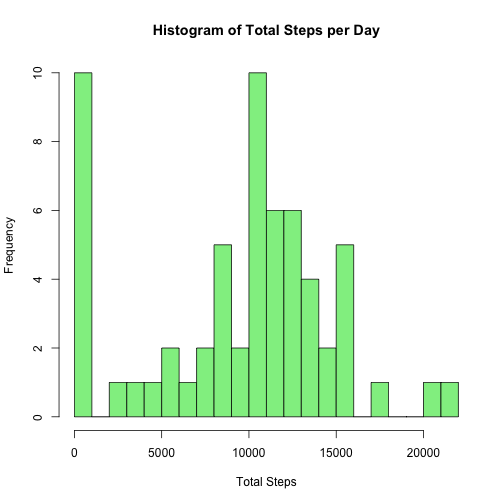
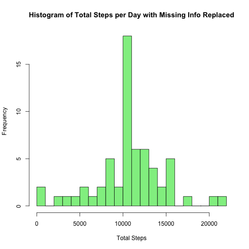
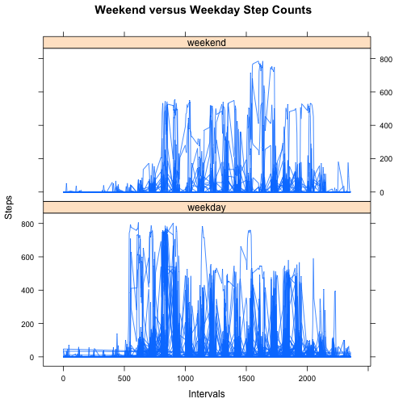

## Loading and preprocessing the data


```r
data <- read.csv("activity.csv")

# Remove NAs
data.clean <- data[!is.na(data$steps),]

# Sum up the number of steps for each day
dates <- levels(data$date)
totalsteps <- numeric()
index <- 1
for(date in dates) {
  totalsteps[index] <- sum(as.numeric(data.clean[data.clean$date == date, "steps"]))
  index <- index + 1
}

data.daysums <- data.frame(totalsteps, dates)
```

## What is mean total number of steps taken per day?


```r
hist(data.daysums$totalsteps, breaks = 30, main="Histogram of Total Steps per Day", xlab = "Total Steps", col = "lightgreen")
```

 

The mean number of steps taken each day:


```r
mean(data.daysums$totalsteps)
```

```
## [1] 9354.23
```

The median number of steps taken each day:


```r
median(data.daysums$totalsteps)
```

```
## [1] 10395
```

## What is the average daily activity pattern?


```r
data.intervalsums <- aggregate(list(steps = data$steps), by = list(intervals = data$interval), FUN = mean, na.rm = TRUE)
plot(data.intervalsums$intervals, data.intervalsums$steps, type = "l", main = "Average Daily Activity based on time of day", xlab = "Intervals", ylab = "Average Steps")
```

 

Calculate where the maximum average number of steps per interval occurs at:


```r
data.intervalsums$intervals[data.intervalsums$steps == max(data.intervalsums$steps)]
```

```
## [1] 835
```

## Imputing missing values

#### How to replace missing values 

We can replace missing data (NAs) with the average number of steps for a specific interval. For example, if at 6:30, the number of steps was NA, we would replace the NA with the average number of steps across all days at 6:30.

Calculate the number of NAs in the data set


```r
length(which(is.na(data$steps)))
```

```
## [1] 2304
```


```r
# Replace the NA values
data.filled <- data
index <- 1
while(index <= nrow(data)) {
  if(is.na(data[index, "steps"])) {
    data.filled[index, "steps"] <- data.intervalsums[which(data.intervalsums$intervals == data[index, "interval"]), "steps"]
  }
  index <- index + 1
}

data.filledsums <- aggregate(list(steps = data.filled$steps), by = list(day = data.filled$date), FUN = sum, na.rm = TRUE)

hist(data.filledsums$steps, breaks = 30, main="Histogram of Total Steps per Day with Missing Info Replaced", xlab = "Total Steps", col = "lightgreen")
```

 

The mean number of steps taken each day:


```r
mean(data.filledsums$steps)
```

```
## [1] 10766.19
```

The median number of steps taken each day:


```r
median(data.filledsums$steps)
```

```
## [1] 10766.19
```

This shows that the mean and median both rose in value after the NA values were replaced with the mean number of steps for the given time interval.

## Are there differences in activity patterns between weekdays and weekends?

Determine if each day is a weekday and store it in a column of the dataset


```r
# Returns either "weekday" or "weekend" from a string date that is passed in
weekday <- function(date) {
  posix.date <- as.POSIXlt(date)
  if(posix.date$wday %in% c("0", "6")) 
    return("weekend")
  else
    return("weekday")
}

data.weekday <- data
index <- 1
while(index <= nrow(data)) {
  data.weekday[index,"weekday"] <- weekday(data[index, "date"])
  index <- index + 1
}
```

Now let's graph a panel plot to compare weekend and weekday steps over time


```r
library(lattice)
xyplot(steps ~  interval | weekday, data = data.weekday, type = "l", layout = c(1, 2), main = "Weekend versus Weekday Step Counts", ylab = "Steps", xlab = "Intervals")
```

 
